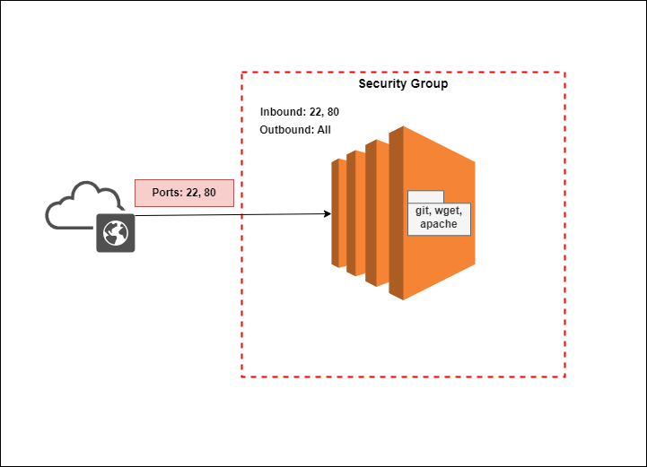

# Project Title
**How to Host an HTML Website on a Linux EC2 Instance**
## Overview
This documentation provides a comprehensive guide on hosting a static website on an AWS EC2 instance using the Apache web server. By following these steps, you can deploy your static website and make it accessible over the internet.

## Architecture


## Prerequisites
Before starting the setup process, ensure that you have the following:

- An AWS account
- An EC2 instance running a Linux distribution. I will be making use of a Red Hat Linux Distribution.
- Security Group set up to open port 22 for SSH access and Port 80 for HTTP access.
- Your static website files (HTML, CSS, JavaScript, etc.)

## Installation and Setup
We will install the following packages for this task.
- git
- apache/httpd

We can make use of the script below to install all these at once.
- After successful SSH into your Linux instance, open a new file to draft our Installation Script.
```sh
vi installation.sh
```
- Paste the following script into the file
```sh
#!/bin/bash
# Update yum repository
sudo yum update -y
# Install git and httpd
sudo yum install git httpd -y
# Start and Enable apache service. Confirm status is running
sudo systemctl start httpd
sudo systemctl enable httpd
sudo systemctl status httpd
```
- Save the installation script, make it executable and run it.
    - Save and Quit the script with `:wq!`
    - Make it executable `sudo chmod u+x installation.sh`
    - Run the script `./installation.sh`


## Configuration & Deployment
- After installing the necessary packages, we can now clone our website files from the repository.
```sh
git clone <repository-url>
```
- Copy the website files into the apache root directory.
```sh
sudo cp -r <website-dir>/* /var/www/html/
```
- Restart the apache service
```sh
sudo systemctl restart httpd
```

## Testing
To view our deployed website;
- View and Copy the public ip address of the Linux Server
```sh
curl ifconfig.io
```
- Paste the ip address on a browser and click go/enter. It should display the hosted website.


## Troubleshooting
Common issues and solutions.
- Apache may sometimes not start due to permission issue. Be sure to start using `sudo` access.
- Website files may not copy to the apache root directory due to permission issue. Be sure to either copy with `sudo` access or change directory mode to allow user to copy using:
```sh
sudo chmod -r 755 /var/www/html
```
- Web page may not display due to firewall issue. Be sure to open port 80 on the applied Security group rule.
- It is encouraged to always restart apache service after making any change to the root directory.

## Security Considerations
Security best practices and measures.
- Ensure least privilege permission is applied. This task only require having inbound access via SSH and HTTP ports. Do not open more than these two ports.
- When running `chmod`, only grant required permissions. Avoid running `chmod 777`

## Acknowledgments
Credits to [AOSNOTE](https://www.aosnote.com/) for the project guidance and [static website content](https://github.com/azeezsalu/techmax).